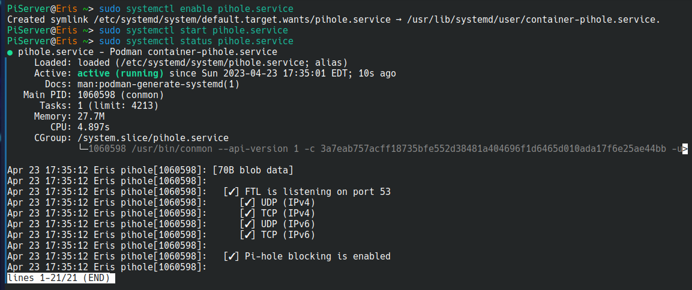

# Pi-Hole Container in Podman

This is my implementation of Pi-Hole on my network. You can use it as is or tweak as needed for your system. I realize there are other ways to do it, but this is what worked on my network router which is a Raspbery Pi CM4 running Fedora Server 37 (at the time of the creation.)

## Prepare volumes for data persistence

In order for the data to be retained in the event of a restart or update to the Pi-Hole container, you really should create volumes in Podman. This only needs to be done the one time.

`sudo podman volume create etc_pihole`
`sudo podman volume create etc_dnsmasq`

You can name the volumes however you like.

## Prepare for the Pi-Hole Container

There is really little to do here. You can create short-cuts if you wish. For instance, I am using Fish and I created a variable which really was unnecessary.

`set container_name "pihole"`

I did nothing at this point to prepare my DNS. However, afterwards, I updated my dnsmasq DNS-lan.conf file to route the DNS server to the Pi-Hole ip on my network. (I deliberately did not wish to have Pi-Hole as my DHCP, so I am still running dnsmasq on the router itself.)

## Starting up Pi-Hole in Podman

This is the command I used to create my Pi-Hole container. It took some experimentation to get it working for me as some of the other solutions out on the internet did not fully work for my case.

`sudo podman run --name $container_name \
                     --hostname=Pi-Hole \
                     --network bridge \
                     --ip=10.0.0.x \
                     --cap-add=NET_ADMIN \
                     --dns=127.0.0.1 \
                     --dns=1.1.1.1 \
                     --detach \
                     --tty \
                     -e TZ=America/New_York \
                     -e SERVERIP=ip_for_container \
                     -e WEBPASSWORD=Your_Password \
                     -e DNS1=1.1.1.1 \
                     -e DNS2=1.0.0.1 \
                     -e DNSSEC=true \
                     -e CONDITIONAL_FORWARDING=true \
                     -e CONDITIONAL_FORWARDING_IP=router_ip_here \
                     -e CONDITIONAL_FORWARDING_DOMAIN=your_local_domain \
                     -e TEMPERATUREUNIT=c \
                     -v etc_pihole:/etc/pihole:Z \
                     -v etc_dnsmasq:/etc/dnsmasq.d:Z \
                     -p 1080:80/tcp \
                     -p 1053:53/tcp \
                     -p 1053:53/udp \
                     docker.io/pihole/pihole:latest`

Now, I am not sure that all of this is necessary and I am sure that my SERVERIP is not working; I had initially attempted to define the ports using this ip address, but it failed most of the time and I have not debugged it. Anyhow, I am able to connect to the Pi-Hole. The key is the ip address defined on the Podman network which we are leveraging here.

## Making the Pi-Hole container into a service

I was able to restart the Pi-Hole after an inadvertant shutdown of the router, but it did not automatically do so which necessitated a manual starting of it and a restart of NetworkManager. So, I went ahead and created service for the container.

`sudo podman generate systemd --new --files --name pihole > pihole.service`
`sudo mv pihole.service /etc/systemd/system`

This alone did not work in my case, so I added.

`sudo mv container-pihole.service /usr/lib/systemd/user`

Then, I created a symbolic link.

`sudo ln -sf /usr/lib/systemd/user/container-pihole.service /etc/systemd/system/pihole.service`

Now, we must restart the systemctl daemon

`sudo systemctl daemon-reload`

Now, enable the Pi-Hole service

`sudo systemctl enable pihole.service`
`sudo systemctl restart pihole.service`

### If the result was an access denied error due to SELinux. Running the following allowed me to execute enable the pihole.service.

`sudo setenforce 0`

Then, repeat the systemctl restart and enable the Pi-Hole service.

Check in on the status of the service

`sudo systemctl status pihole.service`
`sudo podman ps`

